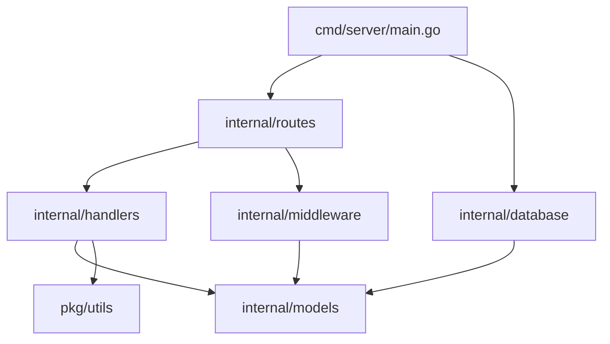
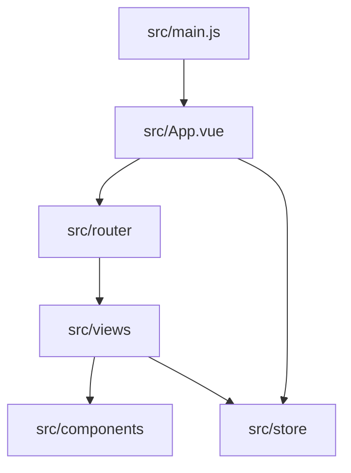

# Dependency Map

## Backend Module Relations

### Penjelasan Relasi Backend:
1.  **`main.go`**: Menghubungkan semua komponen. Melakukan inisialisasi database melalui `internal/database` dan mendaftarkan rute melalui `internal/routes`.
2.  **`internal/routes`**: Bergantung pada `handlers` untuk logika request dan `middleware` untuk proteksi akses.
3.  **`internal/handlers`**: Mengambil dan menyimpan data melalui `internal/models` (GORM). Menggunakan `pkg/utils` untuk fungsi bantuan seperti hashing password.
4.  **`internal/models`**: Berisi definisi struktur data yang digunakan oleh seluruh aplikasi backend.

## Frontend Module Relations

### Penjelasan Relasi Frontend:
1.  **`main.js`**: Titik awal yang memuat library utama (Vue, Pinia, Router) dan me-mount `App.vue`.
2.  **`App.vue`**: Layout utama yang menyediakan `router-view`.
3.  **`src/router`**: Mendefinisikan navigasi antar halaman (Views).
4.  **`src/store`**: Digunakan oleh berbagai `Views` untuk menyimpan state global seperti informasi login (Auth) dan pesan notifikasi (Alert).
5.  **`src/views`**: Komponen halaman utama yang menggunakan `src/components` untuk elemen UI yang lebih kecil dan reusable.

## Full System Integration
- **Backend-Frontend Connection**: Komunikasi dilakukan melalui REST API (`/api/*`).
- **Data Persistence**: Seluruh data disimpan dalam file `cbt.db` melalui GORM.
- **File Storage**: Gambar atau aset yang diunggah disimpan di folder `uploads/` dan disajikan secara statis oleh backend.
