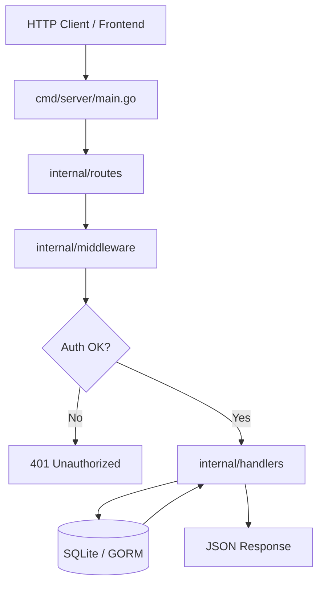

# Backend Architecture

## Overview
Arsitektur backend dibangun menggunakan bahasa pemrograman Golang dengan framework Fiber v2. Pendekatan yang digunakan adalah **Modular Monolith** dengan pola **Fat Handler**, di mana logika bisnis, validasi, dan interaksi database (GORM) dikelola langsung di dalam layer handler untuk efisiensi dan kesederhanaan pada aplikasi skala menengah.

## Request Lifecycle
Setiap request yang masuk ke server mengikuti alur berikut:

## Arsitektur Layer

### 1. Entry Point (`cmd/server/main.go`)
- Inisialisasi konfigurasi dari `.env`.
* Menjalankan koneksi database.
- Registrasi middleware global (Logger, Recover).
- Registrasi router API dan static file server (untuk frontend embedded).

### 2. Router (`internal/routes/routes.go`)
- Mendefinisikan endpoint API.
- Mengelompokkan rute berdasarkan role (`admin`, `guru`, `siswa`).
- Menerapkan middleware proteksi pada group rute tertentu.

### 3. Middleware (`internal/middleware/`)
- **`Protected()`**: Memvalidasi JWT token yang dikirim via header `Authorization: Bearer <token>`. Jika valid, menyimpan `user_id` dan `role` ke dalam `c.Locals`.
- **`RoleRequired(roles...)`**: Memastikan user yang terautentikasi memiliki role yang diizinkan untuk mengakses endpoint tersebut.

### 4. Handler (`internal/handlers/`)
- Layer ini bertindak sebagai Controller sekaligus Service.
- **Tanggung Jawab**:
    - Parsing body request.
    - Validasi input.
    - Eksekusi logika bisnis (misal: perhitungan nilai, validasi jadwal).
    - Interaksi langsung dengan database melalui GORM.

### 5. Database & Models (`internal/models/` & `internal/database/`)
- **Models**: Definisi struct yang merepresentasikan tabel database. Dilengkapi dengan GORM tags untuk relasi (`belongs to`, `has many`, dll) dan JSON tags untuk response.
- **Database**: Inisialisasi koneksi SQLite dan konfigurasi `GORM_DB` singleton.

## Database Flow
Aplikasi menggunakan **GORM** sebagai abstraction layer. Alur interaksi data:
1. Handler memanggil method GORM (`First`, `Find`, `Create`, `Updates`, `Delete`).
2. GORM menerjemahkan perintah ke SQL dialek SQLite.
3. Data dikembalikan dalam bentuk Struct atau Slice of Structs.
4. Handler melakukan `Preload` untuk mengambil data relasi (Eager Loading) guna menghindari masalah N+1.

## Auth Flow (Server Side)
1. **Login**: Verifikasi kredensial -> Hash check (bcrypt) -> Generate JWT dengan claims `id`, `username`, dan `role`.
2. **Verification**: Setiap request terproteksi diperiksa oleh middleware JWT. Token didekode untuk mengambil claims dan memvalidasi masa berlaku.
