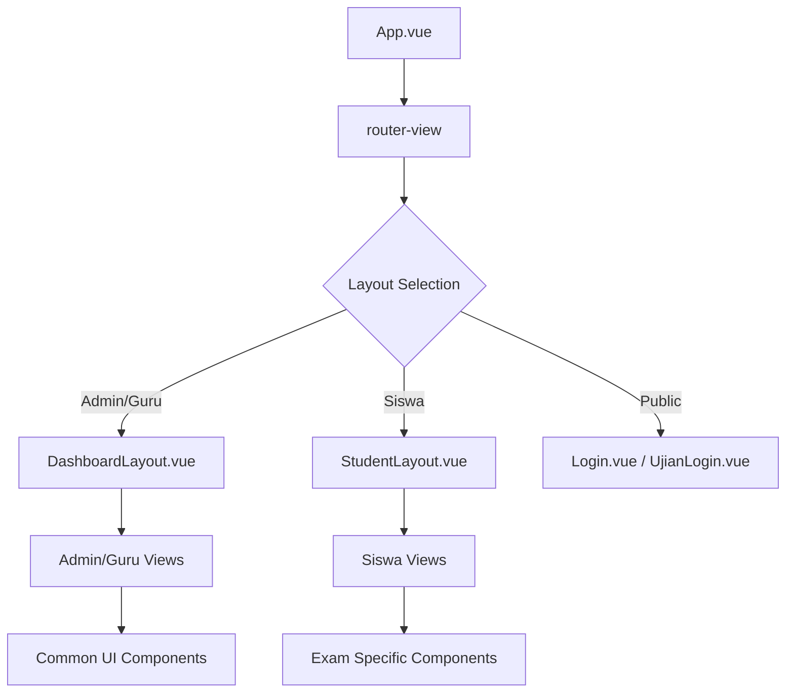

# Frontend Architecture

## Overview
Frontend aplikasi CBT ini dibangun menggunakan **Vue 3** dengan **Composition API**. Aplikasi ini merupakan Single Page Application (SPA) yang sangat reaktif, dirancang untuk performa tinggi selama ujian berlangsung dengan meminimalkan request ke server.

## Component Hierarchy & Layouts
Aplikasi menggunakan sistem layouting untuk memisahkan tampilan administratif dan tampilan ujian siswa.

## State Management (Pinia)
Aplikasi menggunakan **Pinia** untuk mengelola state global:

- **Auth Store (`auth.js`)**: 
    - Menyimpan `token` JWT.
    - Menyimpan metadata `user` (id, nama, role).
    - Sinkronisasi otomatis dengan `localStorage` agar sesi tetap bertahan saat refresh.
- **Exam Store (`exam.js`)**:
    - Mengelola state aktif saat ujian berlangsung (soal, jawaban, sisa waktu).
    - Menangani logika sinkronisasi data ke backend secara terpusat.
- **Alert Store (`alert.js`)**:
    - Mengelola notifikasi sistem (success, error, warning).

## Composables & Business Logic
Untuk menjaga komponen UI tetap bersih, logika bisnis dipisahkan ke dalam folder `composables/`:
- **`useExamTimer.js`**: Logika perhitungan waktu mundur dan pemicu sinkronisasi otomatis.
- **`useAntiCheat.js`**: Logika keamanan (fullscreen & deteksi pindah tab).

## Communication Flow
Frontend berkomunikasi dengan Backend melalui Axios (atau Fetch API bawaan) dengan pola berikut:

1.  **Request Interceptor**: Menambahkan header `Authorization: Bearer <token>` pada setiap request jika token tersedia.
2.  **Response Interceptor**: Menangani error secara global (misal: redirect ke login jika token expired/401).

## Reactive Flow dalam Ujian
Pada halaman `UjianPengerjaan.vue`, flow reaktif dikelola melalui Pinia Store dan Composables:

- **Centralized State**: Seluruh jawaban dan status ujian disimpan di `ExamStore`.
- **Autosave & Batch Sync**: Menggunakan logika "Battlefield Sync" yang memadukan LocalStorage sebagai cache dan Batch API untuk pengiriman data massal guna efisiensi.
- **Timer & Sync Trigger**: `useExamTimer` mengelola detak waktu dan memicu sinkronisasi berkala (misal: setiap 15 detik).
- **Anti-Cheat Logic**: `useAntiCheat` mendeteksi event `blur` pada window untuk mencatat pelanggaran ke database secara otomatis.

## Authentication State
Status login diperiksa di dua tempat:
1.  **Vue Router Guard (`beforeEach`)**: Mencegah akses ke halaman terproteksi jika tidak ada token atau role tidak sesuai.
2.  **Component Level**: Mengambil data user dari Pinia Store untuk menampilkan profil atau membatasi fitur UI.
