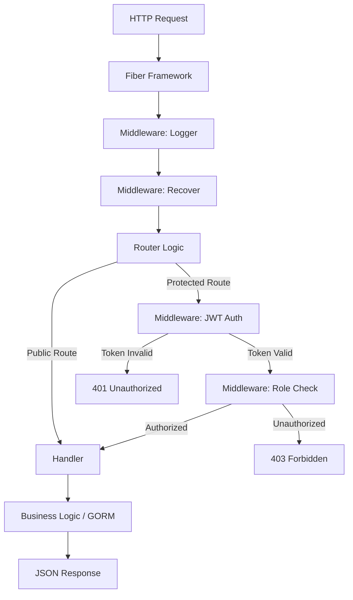

# Request Lifecycle

Dokumen ini mendetailkan perjalanan sebuah HTTP Request dari awal hingga akhir di dalam server Backend.

## Overview Flow

## Step-by-Step Detail

### 1. Inbound Connection
Fiber Framework menerima koneksi TCP dan melakukan parsing HTTP request. Middleware global seperti `Logger` mencatat detail request (Method, Path, IP).

### 2. Authentication Layer (`internal/middleware/auth.go`)
Untuk rute yang berada di bawah group `protected`, middleware `Protected()` dijalankan:
- Memeriksa header `Authorization`.
- Mencoba mendekripsi JWT menggunakan secret key.
- Jika gagal, request dihentikan dengan status `401`.
- Jika berhasil, data `user_id` dan `role` diekstrak dari claims dan disimpan di `c.Locals`.

### 3. Authorization Layer (`internal/middleware/role.go`)
Middleware `RoleRequired()` memeriksa apakah role yang ada di `c.Locals` terdaftar dalam daftar role yang diizinkan untuk rute tersebut. Jika tidak cocok, request dihentikan dengan status `403`.

### 4. Handler Execution (`internal/handlers/`)
Request diteruskan ke fungsi handler yang sesuai. Di sini:
- **Body Parsing**: Menggunakan `c.BodyParser` untuk mengubah JSON request menjadi struct Go.
- **Database Interaction**: Handler berinteraksi dengan `database.DB` (GORM singleton) untuk operasi CRUD.
- **Error Handling**: Jika terjadi error (misal: data tidak ditemukan), handler mengembalikan response JSON dengan status code yang sesuai (misal: `404`).

### 5. Data Persistence & Transaction
Beberapa proses seperti `SyncJawaban` atau `SubmitUjian` menggunakan **Database Transaction** (`db.Transaction`) untuk memastikan atomisitas data. Jika salah satu operasi gagal, seluruh perubahan dalam transaksi tersebut di-rollback.

### 6. Outbound Response
Handler mengembalikan data menggunakan `c.JSON()`. Fiber melakukan serialisasi struct Go menjadi JSON string dan mengirimkannya kembali ke client dengan header yang sesuai.
