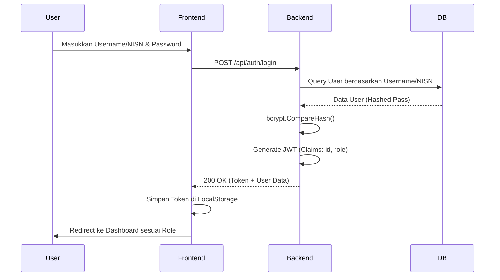
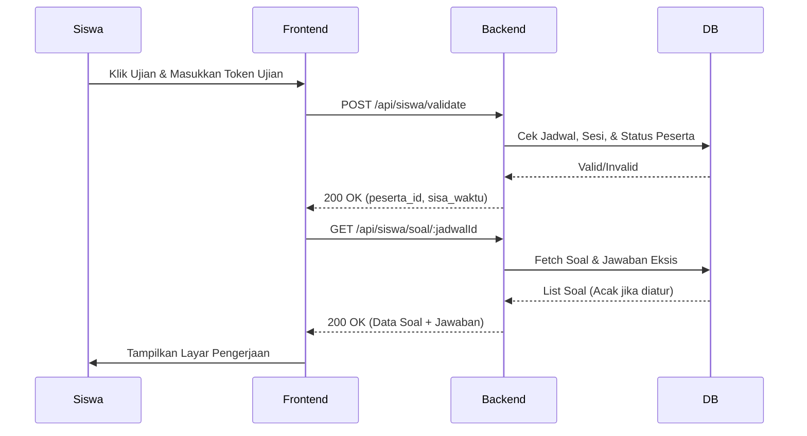
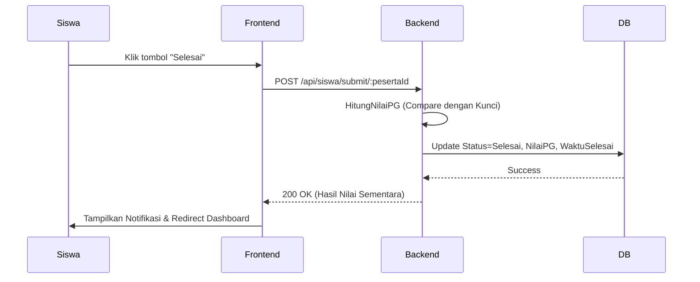
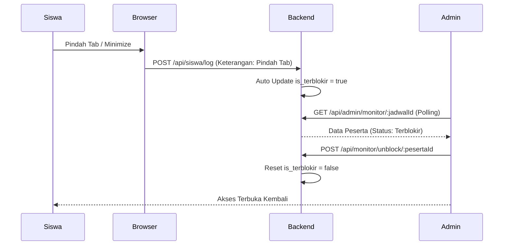
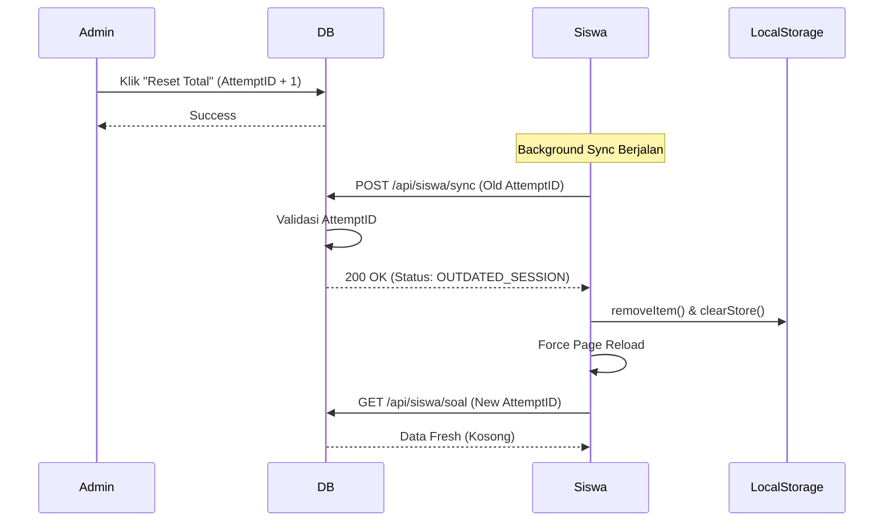

# System Flow

Dokumen ini menjelaskan alur kerja sistem CBT secara step-by-step untuk proses-proses krusial.

## 1. Login Flow (Umum & Siswa)
Proses masuk ke sistem untuk semua role.

## 2. Ujian Flow (Persiapan & Pengerjaan)
Alur siswa mulai masuk ke ruang ujian.

## 3. Submit Flow (Selesai Ujian)
Proses mengakhiri ujian dan perhitungan nilai.

## 4. Scoring Flow (Otomatis & Manual)
- **PG (Pilihan Ganda)**: Dihitung otomatis oleh server saat submit dengan membandingkan `jawaban_siswa` dengan `kunci_jawaban` pada tabel `cbt_soals`.
- **Essay**: Disimpan sebagai teks. Guru melakukan penilaian manual melalui halaman koreksi di Admin Panel, yang kemudian akan mengupdate kolom `nilai_essay` di tabel `cbt_peserta_ujians`.

## 5. Monitoring & Anti-Cheat Flow
Fitur pengawasan real-time oleh Admin/Guru.

## 6. Data Integrity & Session Fencing (Anti-Pollution)
Alur untuk menjamin kebersihan data saat terjadi Reset Total oleh Admin.

