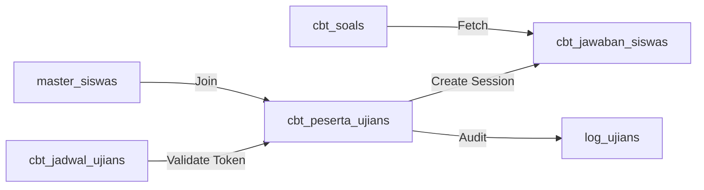

# Database Data Flow

Dokumen ini menjelaskan bagaimana data mengalir antar tabel selama siklus hidup ujian berlangsung.

## 1. Fase Persiapan (Input Data Master)
Data master dimasukkan secara hierarkis:
1.  `master_kelas`, `master_ruangs`, `master_sesis` dibuat.
2.  `users` dibuat, diikuti dengan `master_siswas` dan `master_gurus` yang merujuk pada `users.id`.
3.  `master_mapels` dibuat.

## 2. Fase Pembuatan Konten (Authoring)
Alur pembuatan soal oleh Guru:
1.  Guru membuat record di `cbt_bank_soals`.
2.  Guru memasukkan banyak record ke `cbt_soals` yang merujuk pada `bank_soal_id`.
3.  Admin atau Guru membuat `cbt_jadwal_ujians` dengan memilih `bank_soal_id` dan menentukan `token_ujian`.

## 3. Fase Pelaksanaan (Examination)
Alur data saat ujian berlangsung:

1.  **Validasi**: Sistem mencocokkan input siswa dengan `cbt_jadwal_ujians` dan `master_siswas`.
2.  **Sesi**: Jika valid, record `cbt_peserta_ujians` dibuat.
3.  **Sinkronisasi**: Jawaban siswa dikirim secara batch dan disimpan/diupdate di `cbt_jawaban_siswas`.
4.  **Auto-Save**: Kolom `sisa_waktu_detik` di `cbt_peserta_ujians` diperbarui setiap kali jawaban dikirim.

## 4. Fase Penyelesaian (Scoring & Archiving)
Alur data setelah ujian selesai:

1.  **Auto-Scoring**: Server mengambil `kunci_jawaban` dari `cbt_soals`, membandingkannya dengan `jawaban_siswa` di `cbt_jawaban_siswas`, lalu mengupdate `skor` per butir dan `nilai_pg` di `cbt_peserta_ujians`.
2.  **Manual Correction**: Guru mengupdate `skor` pada `cbt_jawaban_siswas` (untuk essay) dan `nilai_essay` pada `cbt_peserta_ujians`.
3.  **Archiving**: Admin memicu proses arsip, di mana data dari `cbt_peserta_ujians` di-denormalisasi dan disalin ke `cbt_rekap_nilais` sebagai record permanen yang tidak lagi bergantung pada tabel master.

## Data Lifecycle Summary
| Data State | Tabel Utama | Trigger |
| :--- | :--- | :--- |
| **New** | `cbt_bank_soals` | Input Guru |
| **Active** | `cbt_jadwal_ujians` | Penjadwalan Admin |
| **Transient** | `cbt_peserta_ujians` | Login Siswa |
| **Persistent** | `cbt_jawaban_siswas` | Sync Jawaban |
| **Archived** | `cbt_rekap_nilais` | Tutup Jadwal / Archive |
| **Audited** | `log_ujians` | User Activity |
| **Purged** | - | Manual Cleanup by Admin |
| **Snapshot** | `cbt_rekap_nilais` | Finalisasi Nilai |
