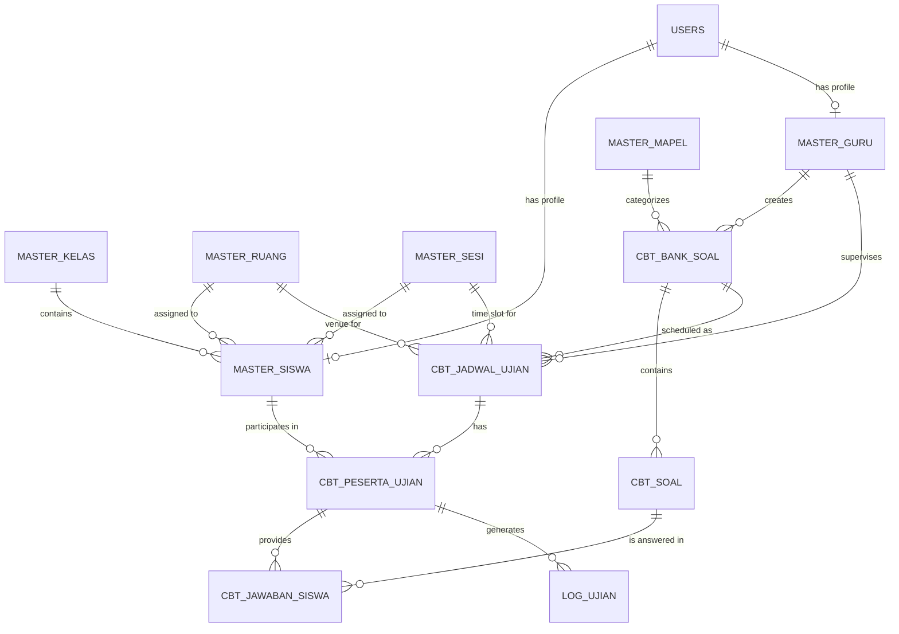

# Entity Relationship Diagram (ERD)

Diagram di bawah menunjukkan hubungan antar tabel dalam sistem CBT.

## Relational Flow
1.  **User Management**: Data User adalah root dari autentikasi. User dihubungkan ke `master_siswas` atau `master_gurus` melalui `user_id`.
2.  **Master Data Binding**: Siswa diikat ke Kelas, Ruang, dan Sesi untuk mempermudah distribusi jadwal.
3.  **Content Creation**: Guru membuat `BankSoal`, yang kemudian diisi dengan banyak `Soal`.
4.  **Scheduling**: `JadwalUjian` mengikat `BankSoal` ke waktu dan lokasi tertentu.
5.  **Examination**: Saat siswa mulai ujian, record `PesertaUjian` dibuat sebagai "session" ujian. Setiap jawaban yang dikirim disimpan di `JawabanSiswa` yang merujuk pada `PesertaUjian` dan `Soal`.
6.  **Monitoring**: Aktivitas mencurigakan dicatat di `LogUjian` yang merujuk pada sesi `PesertaUjian`.
