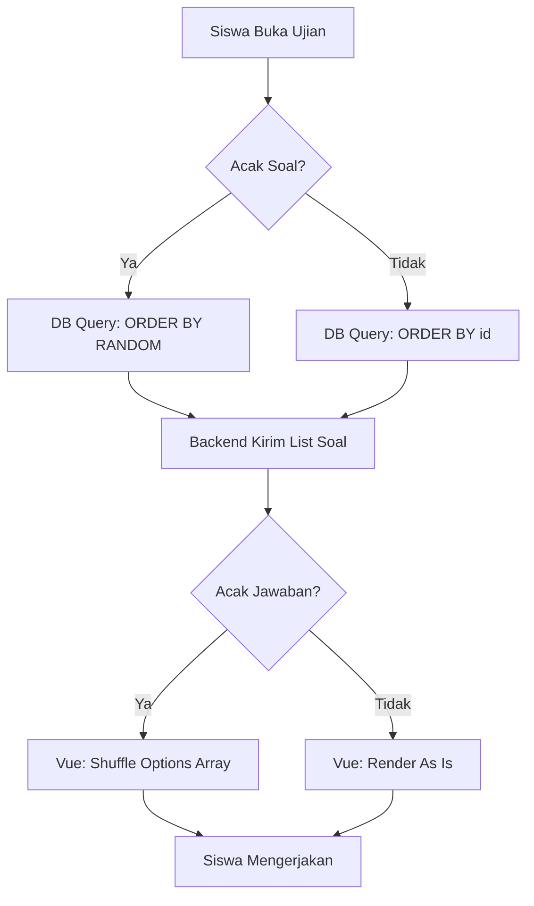

# Randomization Mechanism

Sistem CBT mendukung dua level acakan untuk meminimalisir kemungkinan siswa saling mencontek.

## 1. Acak Soal (Server-Side)
Randomisasi urutan soal dilakukan di level database saat data diminta oleh client.

- **Trigger**: Kolom `acak_soal` pada tabel `cbt_jadwal_ujians` bernilai `true`.
- **Implementasi**: Backend menggunakan query `ORDER BY RANDOM()` (SQLite) atau yang setara.
- **Dampak**: 
    - Setiap kali siswa melakukan refresh atau pertama kali masuk, urutan soal yang diterima dari API `/api/siswa/soal` akan berbeda.
    - Soal nomor 1 bagi Siswa A bisa jadi merupakan soal nomor 25 bagi Siswa B.

## 2. Acak Jawaban / Opsi (Client-Side)
Randomisasi pilihan ganda dilakukan di level aplikasi frontend untuk mengurangi beban server.

- **Trigger**: Kolom `acak_jawaban` pada tabel `cbt_jadwal_ujians` bernilai `true`.
- **Implementasi**: 
    - Server mengirimkan metadata `acak_jawaban: true` bersama daftar soal.
    - Frontend menggunakan fungsi `shuffleArray` (Fisher-Yates Algorithm) untuk mengacak array `opsi_a` sampai `opsi_d` sebelum dirender ke layar.
- **Konsistensi**: Meskipun urutan visual diacak, kunci jawaban (`A`, `B`, `C`, `D`) tetap merujuk pada label asli dari bank soal. Pemetaan ini ditangani secara internal oleh komponen pengerjaan.

## 3. Alur Randomisasi

## 4. Keuntungan & Limitasi

### Keuntungan
- **Integritas Tinggi**: Sangat sulit bagi siswa yang duduk bersebelahan untuk mencocokkan nomor soal dan pilihan jawaban.
- **Performa**: Acak jawaban di client mengurangi beban komputasi server untuk mengolah ribuan string opsi.

### Limitasi
- **Navigasi Manual**: Jika siswa berpindah-pindah soal secara manual, urutan pilihan jawaban bisa berubah kembali jika tidak di-*lock* di state lokal. 
    - **Solusi**: Sistem mengunci urutan pilihan di dalam state `soals` saat pertama kali data di-load, sehingga urutan tetap konsisten selama sesi ujian yang sama berlangsung.
