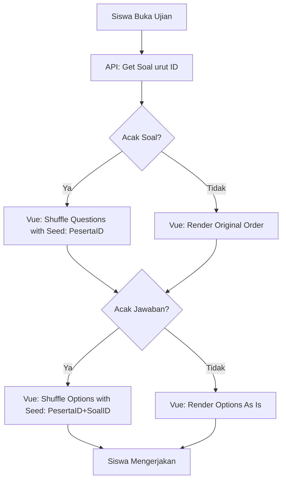

# Randomization Mechanism

Sistem CBT menggunakan metode **Deterministic Shuffling (Seeded Shuffle)** untuk memastikan keadilan ujian. Setiap siswa mendapatkan urutan soal dan jawaban yang acak, namun **tetap konsisten** meskipun halaman di-refresh.

## 1. Konsep Utama: Seeded Shuffle
Alih-alih menggunakan acakan murni (`Math.random()`), sistem menggunakan **ID Peserta** sebagai *Seed* (benih) untuk algoritma pengacakan.
- **Prinsip**: Input yang sama + Seed yang sama = Output Urutan yang selalu sama.
- **Kunci**: `peserta_id` (unik per siswa per jadwal).

## 2. Acak Soal (Hybrid)
Randomisasi urutan soal dikelola dengan kerja sama antara Backend dan Frontend.

- **Backend**: 
    - Mengirimkan soal dalam urutan **ID yang tetap** (`ORDER BY id ASC`).
    - Mengirimkan flag `acak_soal: true`.
- **Frontend**: 
    - Menerima soal yang stabil dari server.
    - Melakukan pengacakan menggunakan `shuffleArray(questions, peserta_id)`.
- **Hasil**: Urutan soal 1, 2, 3... bagi Siswa A akan berbeda dengan Siswa B, namun bagi Siswa A urutan tersebut tidak akan berubah jika ia me-refresh browser.

## 3. Acak Jawaban / Opsi (Client-Side)
Randomisasi pilihan ganda dilakukan sepenuhnya di frontend menggunakan seed gabungan.

- **Trigger**: Kolom `acak_jawaban` pada tabel `cbt_jadwal_ujians` bernilai `true`.
- **Implementasi**: 
    - Menggunakan fungsi `shuffleArray(options, peserta_id + soal_id)`.
    - Penggunaan gabungan `peserta_id` dan `soal_id` memastikan bahwa setiap soal memiliki variasi acakan opsi yang berbeda-beda namun tetap terkunci bagi siswa tersebut.
- **Integritas**: Label visual (A, B, C, D) selalu berurutan secara alfabetis di layar siswa, namun konten di dalamnya telah teracak secara deterministik.

## 4. Alur Randomisasi Terbaru

## 5. Keuntungan Mekanisme Baru
- **Konsistensi State**: Jawaban siswa tidak akan pernah "bergeser" atau salah kunci akibat refresh halaman.
- **Integritas**: Menghilangkan celah kecurangan "refresh-to-shuffle" (mencari urutan soal yang lebih mudah).
- **UX**: Label A, B, C, D tetap rapi dan berurutan secara visual meskipun kontennya teracak.
- **Sync**: Mempermudah sinkronisasi antara LocalStorage dan Database karena urutan index soal selalu bisa dihitung ulang dengan seed yang sama.
