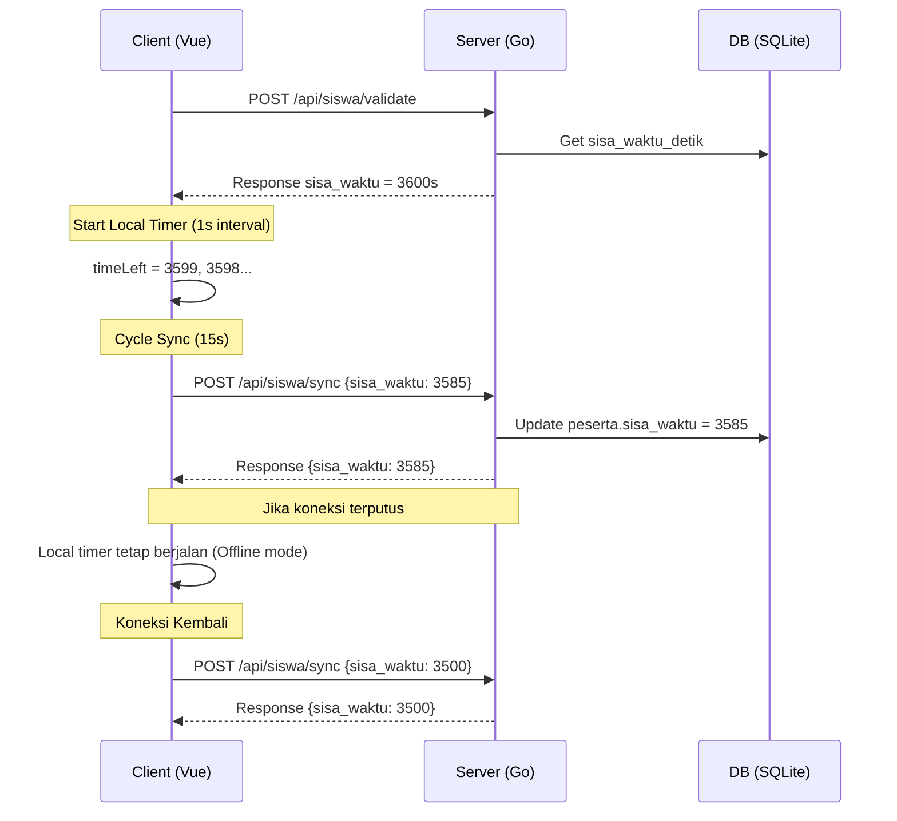

# Timer & Synchronization Flow

Manajemen waktu adalah aspek paling krusial dalam sistem CBT. Sistem ini menggunakan pendekatan **Hybrid Timer** untuk menjamin akurasi meskipun terjadi gangguan koneksi.

## 1. Mekanisme Kerja

### A. Client-Side Countdown
- Saat masuk ke layar ujian, frontend menerima `sisa_waktu` awal dari backend.
- `setInterval` berjalan setiap 1 detik untuk mengurangi nilai `timeLeft` di state Vue.
- **Tujuan**: Memberikan pengalaman UI yang mulus (smooth) bagi siswa tanpa harus terus-menerus bertanya ke server.

### B. Server-Side Authority (Periodic Sync)
- Setiap kali terjadi **Sync Jawaban** (batch sync), frontend mengirimkan nilai `timeLeft` terkininya ke server.
- **Backend** menerima nilai tersebut dan mengupdatenya di tabel `cbt_peserta_ujians`.
- **Response**: Backend mengembalikan nilai waktu yang tersimpan di database. Jika terdapat selisih lebih dari 5 detik antara client dan server, frontend akan dipaksa mengikuti waktu server (Authority Reset).

## 2. Alur Kejadian (Sequence)

## 3. Penanganan Disconnect & Reconnect

### Disconnect (Luring)
- Jika internet mati, local timer tetap berjalan. Siswa tetap bisa menjawab karena data dibackup ke `LocalStorage`.
- Indikator status sync akan berubah menjadi **Offline** (Warna Merah).

### Reconnect (Daring)
- Saat internet kembali, siklus sync berikutnya akan mengirimkan seluruh antrean jawaban beserta posisi timer terakhir.
- Server akan menolak (`403 Forbidden`) jika saat sinkronisasi ternyata waktu di server sudah benar-benar habis, memicu **Auto-Submit**.

## 4. Analisis Potensi Bug
- **Browser Hibernation**: Beberapa browser mobile menonaktifkan JavaScript saat layar mati/tab tidak aktif. Ini bisa menyebabkan timer melambat.
    - **Solusi**: Saat tab kembali aktif (`visibilitychange`), sistem akan melakukan pengecekan selisih waktu sistem atau memaksa fetch ulang status dari server.
- **Manipulasi Client**: Siswa mencoba mengubah variabel `timeLeft` via console.
    - **Mitigasi**: Server memiliki validasi batas wajar pengurangan waktu dan akan melakukan *Force Submit* jika durasi total sejak login sudah melampaui `durasi_menit + buffer`.
