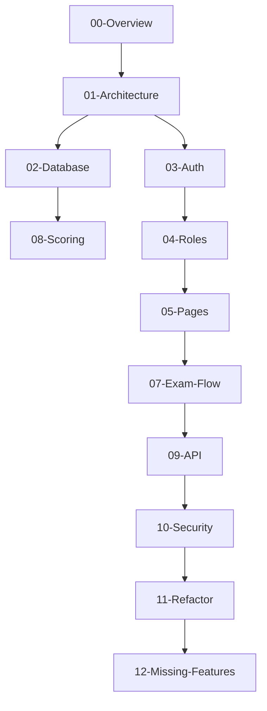

# Master Documentation Summary: CBT System

Dokumen ini adalah ringkasan eksekutif dan panduan navigasi untuk seluruh suite dokumentasi teknis sistem CBT (Computer Based Test).

## 1. Overview Sistem

Sistem CBT ini adalah aplikasi penilaian akademik berbasis web yang dirancang untuk portabilitas dan performa tinggi.
- **Backend**: Go (Fiber Framework) dengan SQLite (GORM).
- **Frontend**: Vue 3 (Composition API) dengan Tailwind CSS dan Pinia.
- **Arsitektur**: Modular Monolith dengan pola Repository-Service (Planned).
- **Fitur Kunci**: Battlefield Sync (Zero Data Loss), Real-time Monitoring, Anti-Cheat Tab Detection, dan Automated Scoring.

## 2. Daftar Isi Dokumentasi

### 📂 [00-Overview](docs/00-overview/)
- [Project Structure](docs/00-overview/project-structure.md)
- [Tech Stack](docs/00-overview/tech-stack.md)
- [Dependency Map](docs/00-overview/dependency-map.md)

### 📂 [01-Architecture](docs/01-architecture/)
- [Backend Architecture](docs/01-architecture/backend-architecture.md)
- [Frontend Architecture](docs/01-architecture/frontend-architecture.md)
- [System Flow](docs/01-architecture/system-flow.md)
- [Request Lifecycle](docs/01-architecture/request-lifecycle.md)

### 📂 [02-Database](docs/02-database/)
- [Database Schema](docs/02-database/schema.md)
- [ERD Diagram](docs/02-database/erd.md)
- [Table Analysis](docs/02-database/table-analysis.md)
- [Data Lifecycle](docs/02-database/data-flow.md)

### 📂 [03-Auth & 04-Roles](docs/03-auth/)
- [Auth Flow](docs/03-auth/auth-flow.md)
- [Role Definitions](docs/04-roles/roles.md)
- [Permission Matrix](docs/04-roles/permission-matrix.md)

### 📂 [05-Pages](docs/05-pages/)
- [Exam Pengerjaan](docs/05-pages/exam-pengerjaan-page.md)
- [Monitoring Dashboard](docs/05-pages/monitoring-page.md)
- [Reporting & Scoring](docs/05-pages/report-page.md)
- [Cetak Kartu Ujian](docs/05-pages/cetak-kartu-page.md)
- [Student Dashboard](docs/05-pages/student-dashboard.md)

### 📂 [07-Exam Flow](docs/07-exam-flow/)
- [Deep Exam Flow](docs/07-exam-flow/exam-flow.md)
- [Timer & Sync](docs/07-exam-flow/timer-flow.md)
- [Randomization](docs/07-exam-flow/randomization.md)
- [Auto-Submit](docs/07-exam-flow/autosubmit.md)

### 📂 [08-Scoring & 09-API](docs/08-scoring/)
- [Scoring Logic](docs/08-scoring/score-calculation.md)
- [API Reference](docs/09-api/api-reference.md)
- [Exam API](docs/09-api/exam-api.md)

### 📂 [10-Security & 11-Refactor](docs/10-security/)
- [Security Audit](docs/10-security/security-audit.md)
- [Vulnerability Report](docs/10-security/vulnerability.md)
- [Code Smells](docs/11-refactor/code-smells.md)
- [Refactor Roadmap](docs/11-refactor/refactor-roadmap.md)

---

## 3. Relasi Antar Dokumen (Dependency Map)

---

## 4. Prioritas Strategis (Action Plan)

### 🔴 High Priority: Security & Compliance
- **Fix IDOR**: ✅ COMPLETED (May 2026).
- **Timer Hardening**: ✅ COMPLETED (May 2026).
- **Session Reset Logic Fix**: ✅ COMPLETED (May 2026) - Fixed timer wiping & State Leakage.
- **Total Reset Feature**: ✅ COMPLETED (May 2026) - Clean restart with DB, LocalStorage purge, and AttemptID Fencing.
- **Mobile Responsive UX**: ✅ COMPLETED (May 2026) - Optimized layout for student exam on mobile devices.
- **Monitoring Safety UI**: ✅ COMPLETED (May 2026) - Action dropdowns & smart positioning.
- **Professional UI Refactor**: ✅ COMPLETED (May 2026) - Indigo-Glass aesthetics & compact design.
- **Smart Auto-Unlock**: ✅ COMPLETED (May 2026) - Real-time block recovery via polling.
- **Unified API Response**: ✅ COMPLETED (May 2026) - Backend refactor.
- **School Identity Management**: ✅ COMPLETED (May 2026) - Integrated profile, logo (Base64), and leadership selection linked to Guru database.
- **JWT Expiry**: Penyesuaian durasi sesi siswa.

### 🟡 Medium Priority: Maintenance & Quality
- **Component Splitting**: ✅ COMPLETED (May 2026) - God Component refactor.
- **Pinia Migration**: ✅ COMPLETED (May 2026) - Exam state centralization.
- **Query Optimization**: ✅ COMPLETED (May 2026) - Evaluasi performa (Stress Test) menunjukkan kode asli paling efisien.

### 🟢 Low Priority: Future Improvements
- **AI Proctoring**: Integrasi verifikasi wajah.
- **Export standard (QTI)**: Mendukung format industri.

---

**Status Dokumentasi**: ✅ Lengkap (Production Ready)  
**Terakhir Diperbarui**: 2026-05-13  
**Disusun Oleh**: Senior Architect & Analyst Team
